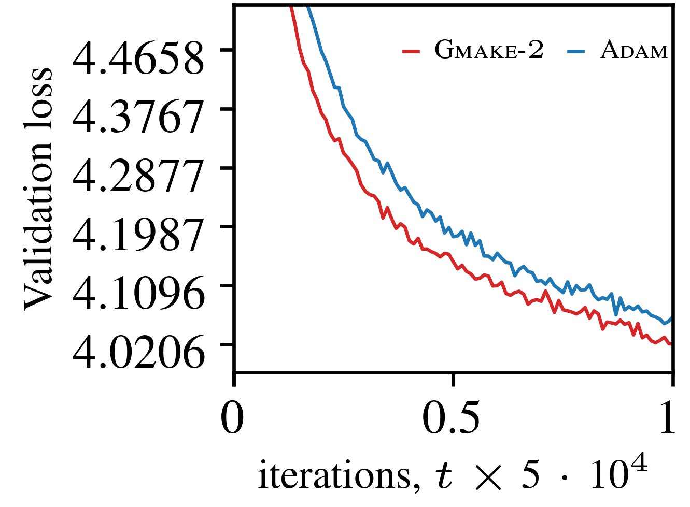
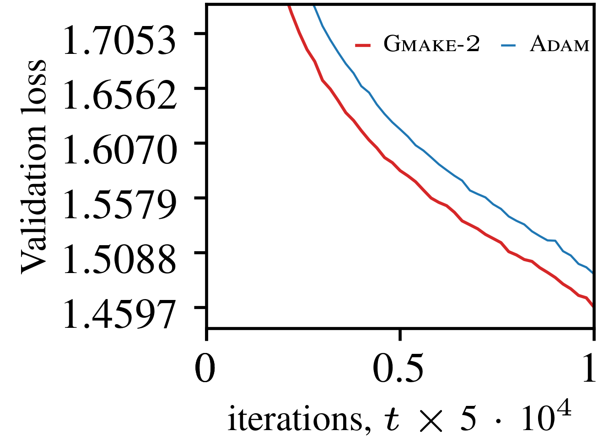

# Understanding Adam with Gmake

GMAKE is a trust-region framework for stochastic gradient updates enforcing a $p$-th moment trust-region constrained step-size, where $p>1$. The framework encodes the **g**radient's second **m**oment **a**nd $p$-th-root **k**urtosis **e**stimation, hence the name `GMAKE`.

## Feature: Unified Stochastic Gradient Optimization Framework
Supports studying: SGD, Heavy-ball momentum, Nesterov momentum, and Adam-like behavior within a unified interface.

- Moment estimation of a $p$-th moment constrained step-size magnitude
- Learning-rate schedules as variational trust-region shaping functions
- Momentum as the design of a trust-region preserving linear time-invariant operator with spectral-norm less than 1.
- [Optional] Matrix-view spectral-norm trust-region constrained step-size magnitudee.

Fully interpretable trust-region constrained step-size mechanism for several practical training elements studied separately. 

---

## Core Concept

For a parameter vector $\mathbf w[t]$ of size $n$, denote the parameter update-step vector at iteration $t$ as

$$\mathbf d[t+1] = \mathbf w[t+1] - \mathbf w[t].$$

Each individual ($i$-th) coordinate of the update-step vector is

$$
\mathbf d[t+1,i] = - \frac{\delta[t]}{\mathbb{E}\left[|\mathbf v[t,i] |^p\right]^{1/p}}\mathbf v[t,i],
$$

where $0 \le \delta[t] \le \mu$, with 

- $\mu> 0$ being a user-defined maximum allowable update step-size.

- $\mathbf v[t]$ being a possibly filtered input stochastic gradient.

The parameter update then satisfies the uniform $p$-th moment trust-region step-size 

$$
\mathbb{E}\left[| \mathbf d[t,i] |^p\right] = \delta[t]^p \le \mu^p
$$

which implies

$$
\mathbb{E}\left[\| \mathbf d[t] \|^p\right] \le n\mu^p
$$


---

### GMAKE Algorithm: SGM_GMAKE 

For Individual parameters in a layer:

**Input and major training hyperparameters:**

* Parameter vector: $\mathbf w[t]$
* Gradient: $\mathbf g[t]$
* Moment order $p\ge 1$
* Max step-size $\mu > 0$
* First-order filter pole $0\le\beta<1$, and filter zero $|\gamma| < \beta$
* Statistical estimators: long-term averaging coefficient $\rho \to 1$, small-epsilon $\epsilon \to 0$ for numerical inversions
* Weight-decay coefficient, $0 < \lambda \ll 1$

#### Legend:

- EMA: exponential moving average estimator
- LSE: linear shrinkage estimator
- ISRM: inverse square-rooth matrix estimator (efficient polynomial recursion)


**For each iteration $t = 1, 2, ...$, do:**

---

**Gradient filtering via a linear time-invariant operator $\mathcal{H}$ with spectral norm less than one (Momentum)**

$$
\mathbf v[t, i] = \mathcal{H}\{\mathbf g[t, i], \beta, \gamma \}
$$

---

2.1 **Learning-rate schedule $\mathcal{T}(t)$**

$$
\delta[t] = \mu \cdot \mathcal{T}(t)
$$


2.2. **Second-moment estimate**

$$
m_2 = \text{EMA}\left(\mathbf g[t, i]^2, \rho\right)
$$

$$
\mathbf v[t, i]  \leftarrow \frac{\mathbf v[t, i] }{\sqrt{m_2} + \epsilon}
$$

2.3. **Normalized $p$-th moment estimate**

$$
m_p = \text{EMA}\left(|\mathbf v[t, i] |^p, \rho\right) \quad \text{or} \quad m_p = \text{LSE}(|\mathbf v[t, i] |^p, \rho)
$$

$$
\mathbf v[t, i] \leftarrow \frac{\mathbf v[t, i] }{m_p^{1/p} + \epsilon}
$$

2.4. **[optional] Matrix-view: inverse-square-root estimate of the covariance matrix $\mathbf v[t]\mathbf v[t]^\intercal$**
$$
\mathbf v[t] \leftarrow \text{ISRM}\left(\mathbf v[t], \epsilon\right)
$$

---

**Decoupled Weight decay step**

$$
\mathbf d[t+1] = \delta[t]\bigl(\mathbf v[t] + \lambda  \mathbf w[t]\bigr)
$$

---

**Update step**

$$
\mathbf w[t+1] = \mathbf w[t] + \mathbf d[t+1]
$$


---

## API Summary

The arguments passed into `SGM_GMAKE` are typical arguments that need to be set to carry out practical training via stochastic gradient learning on deep neural nets.

#### Dependencies
This is a Python-based implementation:

- Ensure the bundled dependency `gmake_lpf.py` is in the same directory with `gmake.py`.
- Ensure ```torch``` is installed

---

##### Example Use

```python
    model = net_model()
    num_iters = int(1e9)
    warmup_steps = 100
    m = warmup_steps/num_iterations

    # Gmake p=2
    optimizer1 = SGM_GMAKE(
        model.parameters(), p=2,
        tr_cfg=(5e-4, 0.9, 'vrg', False),  # trust-region config
        stat_cfg=(0.999, 1e-10, 0, False), # stat. estimator config
        win_cfg=(2, m, 0.1, 0, num_iters)  # lr schedule config
    )

    # Preset API: Adam
    optimizer2 = SGM_GMAKE.Adam(params,
        tr_cfg=(5e-4, 0.9, 'phb'), 
        stat_cfg=(0.999, 1e-10, 0),
        win_cfg=(2, m, 0.1, 0, num_iters)
    )
```

## Comparison vs Adam

Using the same hyperparameters (including weight-decay and cosine annealing), we can compare `Adam`, versus `SGM_GMAKE` ($p=2$).

---

##### 1. Validation loss comparison for GPT2-124M model on FineWeb-Edu subset (50M training tokens, 500k validation tokens) 

 


##### 2. Validation loss comparison for GPT2-124M model on TinyStories-v1 (474M training tokens, 4.8M validation tokens) 

 

*Note*: 
 - All experiments, were repeated three times on a GPT2-124M model, and the average validation loss curves are reported. 
 - The GPT2-124M model was configured to process 8192 tokens per iteration. 
 - Training hyperparameters: $\mu = \{5 \times 10^{-4}, 3 \times 10^{-4}\}$, $\beta=0.9$, $\rho=0.999$, $\epsilon=10^{-10}$, $\lambda=0$. 

---

## Implementation Notes

#### Weight-decay 
* Current implementation decouples weight-decay from gradient normalization 

#### Shape Handling

* Automatically detects vectorized vs matrix-view update step
* Reshapes high-dimensional tensors

##### Numerical Stability

* Uses epsilon regularization
* Normalizes tiny parameter values at initialization

---

## Some Use-cases

Use **GMAKE** when:
* Experimenting with optimization research on adaptive moment-estimation
* You want to experiment with other momentum designs than Heavy-ball and Nesterov momentum
* Training is unstable with Adam
* You want interpretable step-size control against gradient fluctuations


---

## License

*You can explicitly cite this repo if used, or Cite*

Somefun, O. A. 2026. **A Trust-region Framework for Moment Estimation** *Preprint*. 

Personal Web Link: https://somefunagba.github.io/assets/pdf/momest\_trf.pdf

ArXiv Link: https://arxiv.org/pdf/2608.04026

---

## Future Improvements

* Extensive Benchmark suite
* Mixed precision training support
* CUDA kernel optimizations
* Improved documentation

---

